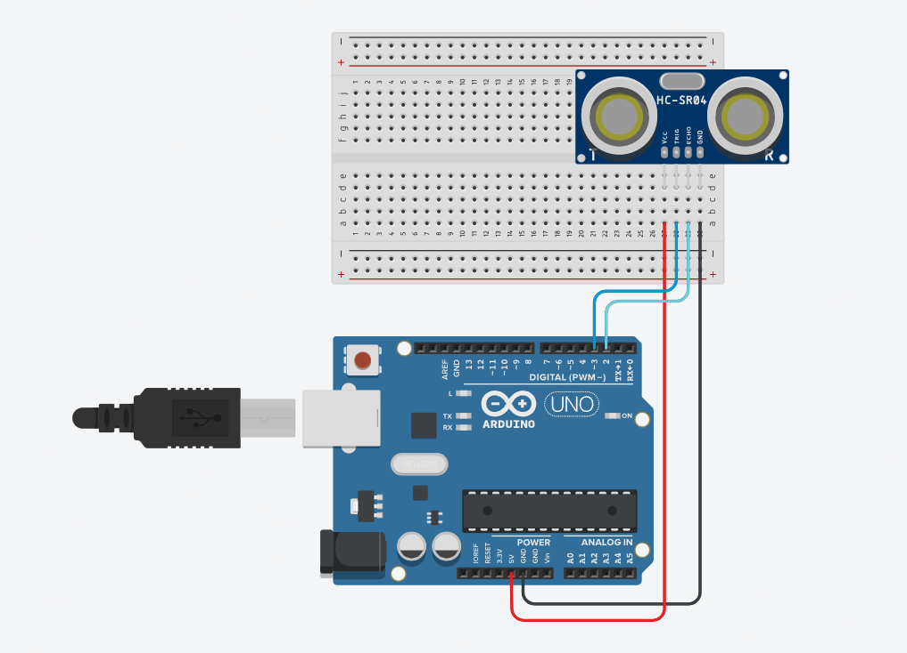

# creativeCircuits

## Project 1
Electronic used :
- 1 Ultrasonic Sensor
- 1 Arduino Uno
- 1 Power Cable
- Some cables to connect Arduino and the Sensor
- 1 Breadboard

Schema :

Softwares used :
- https://www.tinkercad.com/