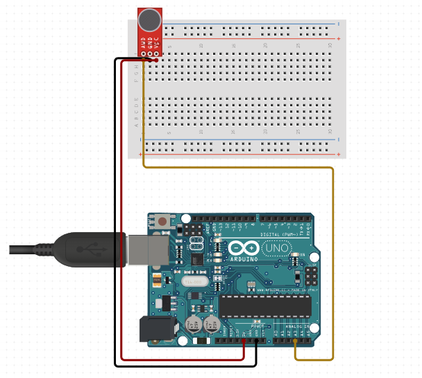

# CREATIVE CIRCUITS

## I. PROJECT DESCRIPTION :
### I.1 Introduction
This repository contains a collection of projects combining Arduino and TouchDesigner. Each project focuses on creating interactive systems and experimenting with artistic ideas. 

### I.2 Goals
The goal is to explore the possibilities of integrating hardware and software for real-time interactions and visualizations.

- Learn Arduino and TouchDesigner.
- Experiment with different electronics and sensors.
- Test creative ideas and explore how users can interact with them.

### I.3 Softwares used :
- https://www.tinkercad.com/
- https://www.circuito.io/
- https://www.arduino.cc/en/software
- https://derivative.ca/

### I.4 References :
- TouchDesigner [Wiki](https://docs.derivative.ca/Main_Page)
- Introduction [Arduino + TouchDesigner](https://jmarsico.github.io/rsma2019/tutorials/)

## II. Ultrasonic Sensor Project
### II.1 Electronics used :
- 1 Ultrasonic Sensor
- 1 Arduino Uno
- 1 Power Cable
- Some cables to connect Arduino and the Sensor
- 1 Breadboard

Schema :

  

### II.2 Visual :

  

## III. Sound Sensor Project
### III.1 Electronics used :

https://randomnerdtutorials.com/guide-for-microphone-sound-sensor-with-arduino/
https://www.youtube.com/watch?v=dPXkWLHYCQk&ab_channel=Acrylicode
https://www.youtube.com/watch?v=ua4zKWJg22g&ab_channel=Ab_out

- 1 Sound Sensor
- 1 Arduino Uno
- 1 Power Cable
- Some cables to connect Arduino and the Sensor
- 1 Breadboard

Schema :

  

### III.2 Visual :